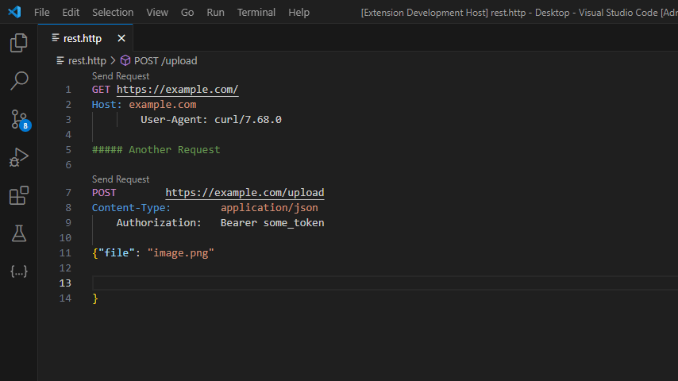

# HTTP Format - REST HTTP TEXT FORMATTER

Format `.http`, `.rest`, and `.txt` files with one keystroke `win+shift+f` (windows) or `cmd+shift+f` (macOS).

        
        

---

---

## Usage

1. Open a file with extensions like `.http`, `.rest`, and `.txt`.
2. Press `win+shift+f` (windows) or `cmd+shift+f` (macOS) to format the file.

## Features

- **Zero Configuration**: Simply open a file and press `win+shift+f` (windows) or `cmd+shift+f` (macOS) to format the file.
- **Customizable Styles**: Look into settings to customize the formatting style.

---

## Requirements

Nothing needed.

---

## Installation

1. Install the **HTTP Format** extension from the Visual Studio Code marketplace and you're set!

---

## For more information or help

- [Email (abcd49800@gmail.com)](mailto:abcd49800@gmail.com)
- [Discord (CodePlayground)](https://discord.gg/ZeeqSBpjU2)

---

**Enjoy!**